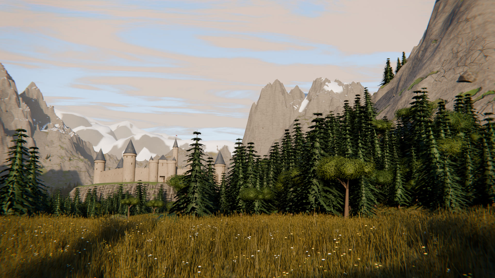
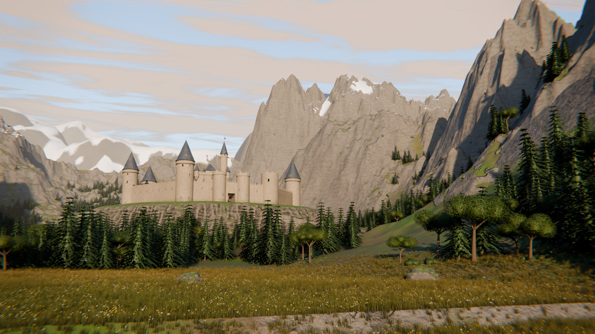
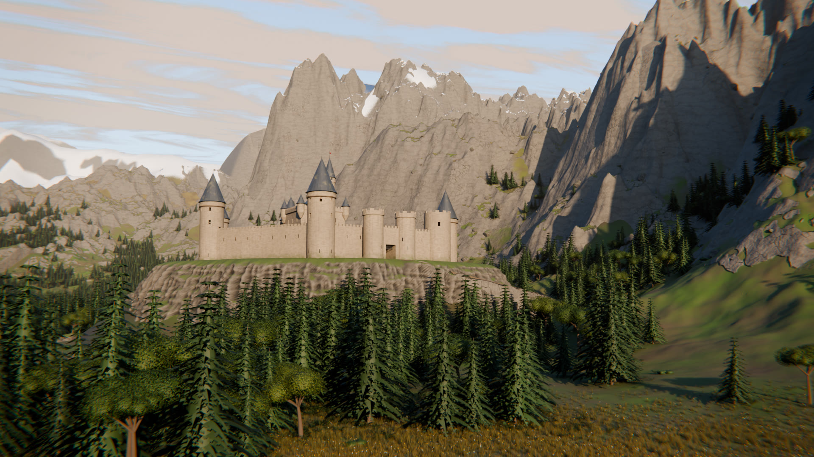

# Reference World: a procedural Blender → Unreal Engine 5 environment

A playable castle-and-river-valley world built entirely from code. Blender
generates the terrain, a large walk-through castle on its cliff,
vegetation, rocks, materials, lighting and camera moves, renders stills
and a flythrough, and exports everything Unreal Engine 5 needs. Unreal then
builds the level and you can walk it in first person: up the road, through
the gatehouse, along the walls, up the towers and through every floor of
the keep. A
Python editor script then rebuilds the same world in Unreal with Lumen,
Nanite, a physical sky, volumetric clouds and a matching Sequencer shot.

> **About the reference video.** This was built to match a castle scene in
> a reference clip on X (`x.com/rewind02/status/2107086047985258639`). The
> build environment's network policy blocks x.com, so the clip could not be
> viewed, and no frames could be captured from it. The scene is therefore an
> interpretation: an original stone castle on a cliff above a river at
> golden hour. The castle and its interiors are a new design, assembled
> procedurally from generic medieval parts. See
> [Matching the reference](#matching-the-reference) for retargeting it from
> screenshots.




| | |
|---|---|
|  |  |

| | |
|---|---|
|  |  |

## What gets generated

| Element | How |
|---|---|
| Terrain | 2.4 km heightfield, 2017² samples (about 1.2 m apart): domain-warped ridged multifractal mountains, a meandering valley, thermal erosion, multi-scale gully detail, hummocky micro-relief and a carved river channel |
| Castle | Original, walkable design about 165 m across. A paved courtyard sits inside curtain walls whose foundations run down the cliff, with wall-walks reached by courtyard stairs. Seven hollow round towers each have a ground room, a wall-walk room and a curved stair to a roofed top room or an open battlemented platform. The gatehouse has a walk-through passage, raised portcullis and open gates. There is a four-storey keep, a 64 m spire, a great hall, houses and a well. Real-scale UVs drive ashlar-stone, slate, clay-tile and timber-plank shaders |
| Interiors | Keep: stores, then a pillared throne hall with dais and banners, then bedchambers, then an armoury, connected by stair flights through stairwells up to a roof deck with a pavilion and turrets. Great hall: timber trusses, long tables, a high table on a dais, a fireplace with chimney, banners and chandeliers. Open, iron-strapped door leaves in the doorways |
| Courtyard and dressing | Market stalls with goods, a hay cart and bales, a smithy with a lit forge, anvil and trough, training dummies and firewood stacks. Pennants fly on the tower cones, and heraldic banners hang on the keep and gatehouse. Ivy climbs parts of the outer walls and some tower bases. The great hall's tables are laid with plates, goblets and lit candles, and the keep has tapestries and a rug. 95 torch, brazier, chandelier, candle, fire, forge and road-lantern lights, exported to Unreal as point lights |
| Crag | The castle's hill is raised and carved after erosion so its cliffs stay sharp. A dedicated polar-grid cliff mesh, at about 0.5 m resolution, wraps it with fractured jointing, ledges, buttress masses and overhangs that a heightfield cannot hold. A switchback road is cut into the hillside from the gate down to the valley, with a timber fence along the drop and lantern posts every 28 m |
| Distant ranges | 16 km low-resolution skirt of snow-capped ranges for layered depth; it continues the main terrain's edge seamlessly |
| Biomes | Slope, height and noise masks for grass, dry grass, rock, snow and wet ground. They drive the shader, the scatter and the Unreal weightmaps |
| Vegetation | 4 spruce variants (branch whorls fringed with needle-tuft cards), 3 broadleaf trees with loose crowns of leaf cards, bushes, ferns, meadow, tall seed-head and short lawn grasses, and two wildflower clumps. All are original procedural meshes. Outward custom normals make canopies shade like soft volumes, and a per-leaf brightness attribute adds texture |
| Rocks | Plane-fractured boulders, small pebbles and 9 m outcrops, with cavity darkening, lichen and moss on upward faces |
| Scatter | About 9k trees, 4k bushes, 1.6k rocks, 700 outcrops plus a talus ring at the crag foot, 9k ferns, 26k pebbles and 420k grass clumps. Placement is deterministic from the masks and keeps clear of the road and the castle. Geometry Nodes instances them in Blender and the same transforms go to Unreal |
| Lighting | Physical multiple-scattering sky, low golden sun at a calibrated sun-to-sky ratio, a cirrus cloud layer, and AgX colour management |
| Grade | Compositor: aerial perspective from the mist pass, sky re-inserted behind geometry, bloom, slight chromatic dispersion and a vignette |
| Camera | 32 mm cine camera on a 10 s rising flight up the river, aimed at the castle, with depth of field. Static shots: a 60 mm castle portrait from the river bank, the great hall interior, and the courtyard from the gate |

## Quick start (Blender)

Blender 4.2+ or the `bpy` module both work. The pipeline was developed and
verified on **Blender 5.2.2** (`pip install bpy`, Python 3.13).

```bash
# fast iteration: 640x360 hero + castle stills in about 2 minutes on 4 CPU cores
python blender/build_world.py --preview

# full quality: 1080p stills, plus exports for Unreal
python blender/build_world.py --export --render stills

# flythrough video (PNG frames, then MP4 if ffmpeg is on PATH)
python blender/build_world.py --render video

# the same commands with a Blender install instead of the bpy module
blender -b -P blender/build_world.py -- --export --render all
```

Outputs land in `build/<preset>/`, which is git-ignored:
`<preset>.blend`, `renders/*.png`, `renders/flythrough.mp4` and `exports/`.
Open the `.blend` to explore or art-direct the scene by hand. Rendering uses
Cycles on the CPU by default; switch the device to GPU in the `.blend` or in
`worldgen/lighting.py` for much faster renders.

## Unreal Engine 5: build and play the map

You need UE 5.3 or later and a C++ toolchain, because the project has a
small C++ module (the first-person character and game mode). On Windows
that is Visual Studio 2022 with the *Game development with C++* workload;
on macOS it is Xcode.

1. Run the Blender build with `--export`. It copies the data into
   `unreal/ReferenceWorld/WorldData/`.
2. Open `unreal/ReferenceWorld/ReferenceWorld.uproject`. Pick your engine
   version if prompted, and answer **Yes** when asked to rebuild the
   `ReferenceWorld` module.
3. Run **Tools › Execute Python Script…** and choose
   `Content/Python/rw_build_level.py`.
4. Press **Play**. You start at the foot of the castle road.

| Control | Keyboard and mouse | Gamepad |
|---|---|---|
| Move | W A S D or the arrow keys | Left stick |
| Look | Mouse | Right stick |
| Jump | Space | A / Cross |
| Sprint | Left Shift (hold) | Left stick click (hold) |

A small HUD shows a centre dot, and a controls hint that fades after a few
seconds.

Things to find: the switchback road and gatehouse, the courtyard stairs up
to the wall-walks, the doors from the wall-walks into the towers and their
curved stairs to the top, the keep's four floors and roof deck, and the
great hall.

The script imports every mesh as Nanite and builds the master materials and
instances from the preset palette. It then creates
`/Game/ReferenceWorld/Maps/L_ReferenceWorld` with:

- **Lighting.** A sun in lux, sky atmosphere, a real-time sky light,
  volumetric clouds, volumetric height fog and an unbound post-process volume.
- **World.** Terrain, distant ranges, the castle and its cliff face, and water.
- **Scatter.** One hierarchical instanced mesh component per vegetation or
  rock variant.
- **Camera.** A `RW_Camera` cine camera and an `LS_Flythrough` sequence that
  replays the Blender camera move. Render it with Movie Render Queue.
- **Materials.** Unreal materials are procedural, using the same patterns as Blender rather than flat colours:
  - Castle stone, slate and clay tiles, and timber planks share a coursed-block shader built from Custom HLSL nodes. It gives each block its own tone, recessed bevelled mortar, weathering noise and grime at the foot of walls.
  - The terrain gets rock strata and macro variation.
  - The river has animated ripples.
  - Foliage sways in the wind, with grass, ferns, bushes and trees tuned separately.
- **Atmosphere.**
  - The sun lights the volumetric fog and throws light shafts.
  - A second, low fog layer lays mist along the valley floor.
  - The post process applies a split-tone grade: warm highlights, cool shadows and slightly more saturation.
  - Auto exposure has the range to adapt when you walk into torch-lit rooms.
  - Lumen runs at raised final-gather and scene-lighting quality.
- **Performance.** Grass, pebbles, ferns and bushes fade out with distance, and grass and pebbles cast no shadows.
- **Playability.**
  - Terrain, cliff and castle use their own triangles as collision, so every stair, floor and wall-walk is walkable.
  - Trees collide only at the trunk and rocks with a convex hull, through exported `UCX_` proxies.
  - Grass, ferns, pebbles and bushes have no collision.
  - Torches, chandeliers and fires become point lights.
  - A PlayerStart, invisible world-boundary walls and `RWGameMode` complete the map.

**Optional landscape.** For a sculptable, paintable landscape instead of the
terrain mesh, open Landscape mode, choose *Import from File* with
`WorldData/heightmap_r16.png`, and use the `landscape` scale and location
values from `WorldData/manifest.json`. The `weight_*.png` files are the
matching layer weightmaps.

> The Unreal script and C++ module were written against the UE 5.3–5.5 APIs,
> but neither could be compiled or executed in the build environment, which
> has no Unreal Engine.
> The Blender → Unreal transform conversion was verified numerically against
> Unreal's rotator maths. If an API call differs in your engine version, the
> Output Log names the line. Most calls already have fallbacks.

## The serene meadow (`serene_meadow`)

A second map from the same pipeline: a large, quiet meadow about 1.4 km
across, ringed by forested hills, with mountains on the horizon.

- **Lane.** A two-track country lane runs through the middle: two earth wheel ruts with a grass strip between them. The ruts are drawn per pixel from each terrain vertex's exact distance to the lane centreline, so they stay crisp at any terrain resolution.
- **Grass.** About 1.6 million grass and wildflower clumps cover the whole meadow. They are densest along the lane, around the ruins and at the camera positions, and wildflower drifts tint the meadow from afar. A few big solitary trees stand out in the grass, and a small pond lies west of the lane.
- **Fences.** Weathered post-and-rail fences line stretches of the lane, enclose a paddock and cross the fields. Posts lean or are missing, and rails are gone or dropped at one end. Some field boundaries are dry-stone walls with collapsed gaps.
- **Abandoned buildings.** All original designs, built with the same kit as the castle:
  - a roofless stone cottage with jagged walls, fallen rafters, scattered slates and a hearth
  - a timber barn skeleton with a sagging, holed roof and missing boards
  - a lone chimney stack over the footings of a burnt-out house
  - the arched gable wall of a ruined chapel
  - an old well and a cart wreck

  The masonry is rough, mossy rubble with ivy, rubble heaps lie around every ruin, and grass grows inside them.
- **Marsh pond.** A small, highly detailed marsh about 70 m west of the lane:
  - **Ground.** The shoreline is a lobed, noise-warped outline. A shallow reed shelf drops to a 1.5 m deep centre, inside a low, wet margin. A high-resolution terrain patch with vertices about 0.24 m apart replaces the main terrain there. It adds sedge tussocks, real puddles, silt and mud micro-relief, and its edges match the main terrain exactly at full and export resolution.
  - **Plants.** Cattail clumps with velvety seed heads stand in the shallows, and tall reeds with feathery plumes line the shore. Sedge tussocks cover the wet margin, and water-lily clusters float on the deeper water, with notched pads, white and pink flowers, and buds.
  - **Wood.** A weathered boardwalk runs out over the water, with missing and broken planks, a sagging end and a loose plank afloat. A mossy fallen log lies half in the water with its root plate on the bank, a dead snag stands in the shallows, and stepping stones cross the margin.
  - **Water and mud.** The water is tea-brown, with ripples, duckweed mats where it is shallow and a faint pollen film. The mud is dark and glossy where saturated, and the pond bed has silt, algae and leaf litter.

  Its stills are `marsh` (across the pond) and `marsh_close` (kneeling at the end of the boardwalk over the lilies).

```bash
python blender/build_world.py --preset serene_meadow --preview          # quick look
python blender/build_world.py --preset serene_meadow --export --render stills
```

Its stills are `hero` (eye level on the lane), `cottage`, `barn`, `chapel`,
`marsh`, `marsh_close` and `overview`. In Unreal, each preset gets its own folder and map:
`/Game/ReferenceWorld/<preset>/Maps/L_<preset>`. Exports go to
`WorldData/<preset>/`, so the castle valley and the meadow live side by
side. The level script builds the most recent export by default; run
`rw_build_level.main("serene_meadow")` to pick one explicitly.

## Presets

Presets live in `presets/*.json`. Each one sets only what it changes and can
`extend` another preset. Every available key, with comments, is in
`blender/worldgen/config.py`.

| Preset | Look |
|---|---|
| `golden_valley` | Default. Low warm sun from behind-left, golden meadow, crisp distant snow ranges |
| `misty_morning` | Soft, high-haze, cool morning light |
| `alpine_dusk` | Sun on the horizon, valley in shadow, alpenglow on the peaks |
| `serene_meadow` | The meadow map: late-afternoon light, wildflowers, lane, fences and ruins |

```bash
python blender/build_world.py --preset misty_morning --preview
```

## Matching the reference

1. Save 3 to 6 frames from the reference video, for example the wide
   establishing shot, a close shot and the end frame.
2. Derive a starting preset from them:

   ```bash
   python tools/match_reference.py ref_*.png --name reference
   python blender/build_world.py --preset reference --preview
   ```

   The tool estimates vegetation colours, sun colour and elevation, haze
   colour and amount, contrast and snow coverage. It also writes
   `presets/reference_swatches.png` so you can compare the palette with the
   reference at a glance.
3. Fine-tune by eye. The knobs that matter most:

   | To change | Edit |
   |---|---|
   | Time of day, light direction | `lighting.sun_elevation_deg`, `lighting.sun_azimuth_deg` (0 is straight down the valley, ±180 is behind the camera) |
   | Atmosphere depth | `lighting.haze_amount`, `lighting.mist_depth_m`, `lighting.aerosol_density` |
   | Mountain drama | `terrain.mountain_height_m`, `terrain.backdrop_height_m`, `terrain.skirt_height_m` |
   | Valley shape | `terrain.valley_width_m`, `terrain.meander_amp_m`, `terrain.river_width_m` |
   | Forest density | `biome.tree_count`, `biome.conifer_ratio`, `biome.treeline_m` |
   | Snow | `biome.snowline_m` |
   | Camera move | `camera.path` keys (`y` along the valley, `height`, `x` offset, `yaw`, `pitch`) |
   | Castle position | `castle.y`, `castle.river_offset_m` |
   | Castle hill | `castle.crag_height_m`, `castle.plateau_radius_m`, `castle.crag_radius_m` |
   | Castle footprint | `castle.plateau_radius_m` (the courtyard and walls scale with it) |
   | Castle massing | `castle.tower_count`, `castle.tower_radius_m`, `castle.tower_height_m`, `castle.wall_height_m`, `castle.keep_size_m`, `castle.spire_height_m` |
   | Castle colours | `palette.stone`, `palette.roof`, `palette.roof_alt`, `palette.cloth` |

For the castle itself, frames from the reference show the massing to aim
for: how many towers, roof shapes, the keep's height, and where it sits.
If the reference castle is a real place, `castle.py` can follow it closely
from photos. If it comes from a game, film or another artist's work, the
better route is to match its proportions, style and mood with an original
design rather than copying it.

## Layout

```
reference-world/
├── blender/
│   ├── build_world.py        entry point (CLI)
│   └── worldgen/
│       ├── config.py         defaults + preset loading
│       ├── noise.py          vectorised Perlin / fBm / ridged noise (numpy)
│       ├── terrain.py        heightfield, erosion, masks, skirt, mesh build
│       ├── materials.py      procedural Cycles shaders
│       ├── assets.py         trees, bushes, ferns, grasses, rocks (bmesh)
│       ├── castle.py         walkable castle kit + layout, interiors, lights, cliff mesh
│       ├── meadow.py         meadow lane fences, dry-stone walls, abandoned buildings
│       ├── scatter.py        placement + Geometry Nodes instancers
│       ├── lighting.py       sky, sun, clouds, render + compositor
│       ├── camera.py         cine camera + flythrough keys
│       ├── export.py         FBX / heightmap / scatter / manifest for UE
│       └── png.py            dependency-free PNG writer
├── presets/                  look presets (JSON)
├── tools/match_reference.py  derive a preset from reference frames
├── unreal/ReferenceWorld/    UE5 project: config, C++ player module, editor Python script
└── previews/                 committed preview renders
```
